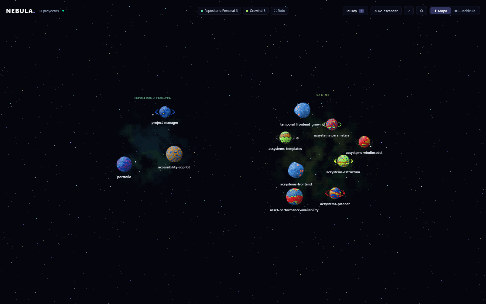

# 🌌 Nebula

> Gestor visual **local** de proyectos y repositorios que convierte tu actividad de desarrollo en un mapa espacial pixel-art interactivo.

Nebula detecta automáticamente los repositorios Git de tu máquina y representa cada proyecto como un planeta pixel-art procedural generado a partir de su ADN: lenguajes, tamaño, complejidad y actividad reciente. Cada carpeta raíz que configures es una zona del mapa con su propia nebulosa.

<p align="center">
  
</p>

## Índice

- [Características](#características)
- [Requisitos](#requisitos)
- [Instalación rápida](#instalación-rápida)
- [Primer arranque](#primer-arranque)
- [Desarrollo](#desarrollo)
- [Modo desatendido en Windows](#modo-desatendido-en-windows)
- [Acceso desde móvil o tablet](#acceso-desde-móvil-o-tablet)
- [Integraciones opcionales](#integraciones-opcionales)
- [Atajos principales](#atajos-principales)
- [Stack tecnológico](#stack-tecnológico)
- [Arquitectura del repositorio](#arquitectura-del-repositorio)
- [Seguridad y privacidad](#seguridad-y-privacidad)
- [Documentación](#documentación)
- [Licencia](#licencia)

## Características

- **Detección automática de repositorios**: selecciona carpetas desde la interfaz mediante el navegador integrado y Nebula localiza los repositorios Git. Los watchers detectan repositorios nuevos o eliminados sin reiniciar.
- **Arte pixel generativo por proyecto**: cada repositorio tiene un planeta único y determinista (rocoso, gaseoso, anillado, cristalino o estación) renderizado en un motor Canvas 2D propio, sin un solo asset dibujado a mano.
- **Mapa por zonas**: cada carpeta raíz es una región etiquetada del mapa, con pan, zoom con snap a píxel y encuadre por zona.
- **ADN visual del repositorio**: los colores representan la mezcla de lenguajes; el tamaño refleja la complejidad; y el pulso muestra la actividad reciente.
- **Git en tiempo real**: muestra rama actual, estado del working tree, ahead/behind, ramas, últimos commits y actividad reciente, actualizado mediante WebSocket.
- **Agentes de IA**: unifica las sesiones de **Claude Code**, **Codex CLI**, **Cursor**, **Gemini CLI** y **Antigravity** por proyecto.
- **Detección de sesiones activas**: el planeta de un proyecto late y suelta partículas mientras un agente está trabajando.
- **Vista Hoy**: reúne tareas, avisos Git y agentes activos de todos los proyectos.
- **Creación rápida de tareas**: permite añadir tareas desde la vista Hoy utilizando `@proyecto`.
- **Kanban por proyecto**: organiza tareas manuales, sugeridas por agentes y sincronizadas desde servicios externos.
- **Integración con Jira**: importa issues asignados al usuario y permite cerrarlos desde Nebula mediante write-back.
- **Integración con Microsoft Planner**: sincroniza tareas de Planner mediante autenticación delegada de Microsoft 365.
- **Control de sincronización**: permite desactivar la escritura hacia Jira o Planner y utilizar las integraciones en modo de solo lectura.
- **Grafo de conocimiento**: renderiza en 3D la salida de [Graphify](https://github.com/safishamsi/graphify) cuando existe `graphify-out/graph.json`.
- **Integración con Obsidian**: encuentra notas relacionadas con cada proyecto y las abre mediante `obsidian://`.
- **Command palette**: usa `Ctrl+K` para buscar proyectos, localizar tareas o crear una nueva.
- **Panel de ajustes**: configura carpetas, sincronización, notificaciones, intervalos y acceso desde otros dispositivos.
- **Experiencia responsive**: interfaz adaptada a escritorio, móvil y tablet.
- **Tour de bienvenida y ayuda integrada**: onboarding saltable y ayuda permanente con la tecla `?`.

## Requisitos

- [Node.js](https://nodejs.org/) **24 o superior**
- [pnpm](https://pnpm.io/)
- [Git](https://git-scm.com/) disponible en el `PATH`

Instalación global de pnpm:

```bash
npm install -g pnpm
```

Las integraciones y agentes son opcionales. Si una herramienta no está instalada o configurada, Nebula continúa funcionando sin aportar datos de esa fuente.

## Instalación rápida

```bash
git clone https://github.com/InigoSanz/project-manager.git
cd project-manager
pnpm go
```

`pnpm go`:

1. instala las dependencias si es necesario;
2. compila la interfaz si todavía no existe un build;
3. inicia el servidor y la aplicación.

Después abre:

```text
http://localhost:4816
```

## Primer arranque

Al iniciar Nebula por primera vez:

1. La aplicación intenta detectar automáticamente dónde se encuentran tus repositorios.
2. Si no encuentra ninguno, muestra la opción **Elegir carpeta de proyectos**.
3. Selecciona una carpeta raíz que contenga tus repositorios.
4. Nebula escanea la ruta y añade los proyectos encontrados.
5. Puedes añadir más carpetas desde **Ajustes**.

La configuración se almacena en:

```text
~/.nebula/config.json
```

Los datos locales se almacenan en:

```text
~/.nebula/
```

## Desarrollo

Instala las dependencias:

```bash
pnpm install
```

Inicia el entorno de desarrollo:

```bash
pnpm dev
```

Servicios disponibles:

- Interfaz web con hot reload: `http://localhost:5173`
- API y WebSocket: `http://localhost:4816`

Comandos principales:

```bash
pnpm dev          # inicia todos los paquetes en modo desarrollo
pnpm dev:web      # inicia únicamente la interfaz
pnpm dev:server   # inicia únicamente el servidor
pnpm typecheck    # comprueba los tipos del monorepo
pnpm build        # compila la interfaz web
pnpm start        # inicia el servidor en modo normal
pnpm go           # instala, compila e inicia
```

## Modo desatendido en Windows

Nebula puede iniciarse automáticamente y sin mostrar una terminal al comenzar la sesión de Windows.

Instalar el arranque automático:

```bash
pnpm autostart:install
```

Eliminarlo:

```bash
pnpm autostart:uninstall
```

La aplicación seguirá disponible en:

```text
http://localhost:4816
```

## Acceso desde móvil o tablet

Nebula puede exponerse dentro de la red local:

1. Abre **Ajustes**.
2. Activa **Acceso desde la red local**.
3. Reinicia el daemon.
4. Escanea el código QR desde un dispositivo conectado a la misma red.

> [!WARNING]
> Activa el acceso LAN únicamente en redes de confianza. Cuando está habilitado, otros dispositivos de la red local pueden acceder a la aplicación.

## Integraciones opcionales

### Agentes de IA

Nebula puede detectar sesiones de:

- Claude Code
- Codex CLI
- Cursor
- Gemini CLI
- Antigravity

No es necesario instalar todos los proveedores.

### Jira

Permite:

- importar issues asignados al usuario;
- asociarlos a repositorios;
- mostrarlos como tareas del kanban;
- cerrar issues desde Nebula mediante write-back.

Puede configurarse en modo de solo lectura desactivando la escritura desde **Ajustes**.

### Microsoft Planner

Permite:

- iniciar sesión mediante Microsoft 365;
- sincronizar tareas asignadas;
- completar tareas desde Nebula;
- utilizar autenticación delegada de Microsoft 365.

La caché de tokens se almacena localmente en:

```text
~/.nebula/msal-cache.json
```

### Graphify

Nebula renderiza el grafo cuando encuentra:

```text
graphify-out/graph.json
```

Ejemplo de generación:

```bash
uv tool install graphifyy
cd tu-repositorio
graphify map
```

### Obsidian

Nebula busca notas relacionadas con cada proyecto en los vaults detectados y las abre mediante enlaces `obsidian://`.

## Atajos principales

| Atajo | Acción |
|---|---|
| `Ctrl+K` | Abrir la command palette |
| `T` | Abrir la vista Hoy |
| `?` | Abrir la ayuda |
| `@proyecto` | Asociar una tarea rápida a un proyecto |

## Stack tecnológico

### Frontend

- React
- TypeScript
- Vite
- Tailwind CSS
- Motor pixel-art propio sobre Canvas 2D (sprites y ruido procedurales)
- Zustand
- Framer Motion

### Backend

- Node.js
- TypeScript
- Fastify
- WebSocket
- SQLite
- Chokidar

### Organización

- Monorepo con pnpm workspaces
- Tipos compartidos entre servidor e interfaz
- Datos locales almacenados en `~/.nebula/`

## Arquitectura del repositorio

```text
.
├── docs/       # documentación técnica y funcional
├── scripts/    # arranque rápido y autostart de Windows
├── server/     # daemon, API, WebSocket, SQLite e integraciones
├── shared/     # tipos TypeScript compartidos
└── web/        # interfaz React y motor pixel-art 2D
```

El servidor actúa como fuente de verdad:

1. escanea los repositorios;
2. analiza Git, lenguajes y actividad;
3. persiste los datos en SQLite;
4. observa cambios en repositorios y sesiones;
5. publica eventos mediante WebSocket;
6. actualiza la interfaz en tiempo real.

Consulta [Arquitectura](docs/arquitectura.md) para una explicación detallada.

## Seguridad y privacidad

Nebula está diseñado para funcionar localmente.

- Por defecto, el servidor escucha únicamente en `127.0.0.1`.
- El acceso LAN está desactivado inicialmente.
- Las credenciales de Jira se almacenan localmente en `~/.nebula/config.json`.
- Los tokens de Microsoft se almacenan en `~/.nebula/msal-cache.json`.
- No debes subir el contenido de `~/.nebula/` a un repositorio.
- El write-back de Jira y Planner puede desactivarse.
- Nebula solo realiza conexiones externas hacia los servicios que configures y hacia los remotos Git cuando habilitas operaciones como `fetch`.

> [!CAUTION]
> Las credenciales de Jira se guardan en texto plano en el equipo local. Protege tu cuenta de usuario, no compartas el archivo de configuración y revoca cualquier token expuesto.

Consulta [Configuración](docs/configuracion.md) para conocer todos los detalles.

## Documentación

La documentación completa se encuentra en [`docs/`](docs/README.md):

- [Instalación](docs/instalacion.md)
- [Configuración](docs/configuracion.md)
- [Arquitectura](docs/arquitectura.md)
- [Agentes de IA](docs/agentes.md)
- [Integraciones](docs/integraciones.md)
- [Sistema visual](docs/visuales.md)
- [API](docs/api.md)
- [Solución de problemas](docs/solucion-problemas.md)

## Actualización

Para actualizar una instalación existente:

```bash
git pull
pnpm install
pnpm build
```

Después reinicia el daemon.

## Solución de problemas

Consulta [Solución de problemas](docs/solucion-problemas.md).

Comprobaciones básicas:

1. ejecuta `pnpm typecheck`;
2. comprueba que Node.js y pnpm cumplen los requisitos;
3. verifica que el puerto `4816` no está ocupado por otra aplicación.

## Licencia

Este proyecto se distribuye bajo la licencia [MIT](LICENSE).

---

Desarrollado por [Iñigo Sanz](https://github.com/InigoSanz).
